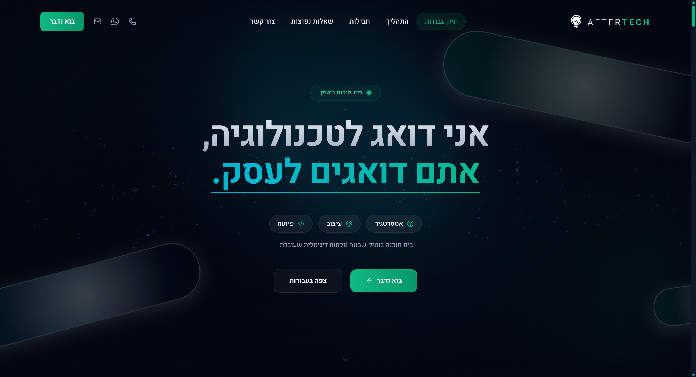
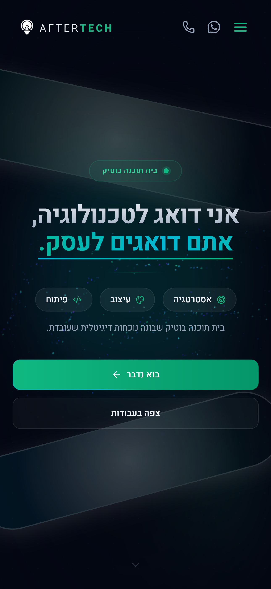

<div align="center">

# AfterTech

**Boutique web agency landing page — Hebrew RTL, dark-mode, conversion-focused**

A single-page marketing site for an Israeli web development studio, built on Next.js 16's App Router as a fully static export — 16 pages of hand-tuned HTML, three rendering tiers, and CSS-driven scroll reveals that keep JavaScript off the sections that don't need it.

<br />

[](https://www.after-tech.co.il)

<br /><br />

[](https://nextjs.org/)
[](https://react.dev/)
[](https://www.typescriptlang.org/)
[](https://tailwindcss.com/)
[](https://threejs.org/)
[](https://vercel.com/)

</div>

---

## Preview

<div align="center">

### Desktop



### Mobile



</div>

---

## About

Built end-to-end as the sole engineer — the codebase itself is private; this README is the portfolio-facing summary covering the architecture, engineering decisions, and screenshots I can share publicly.

---

## How This Was Built

Built solo, **AI-first**: I orchestrate AI coding agents (Claude Code, Codex) through a documented methodology rather than writing every line by hand — the engineering discipline is the point, not the speed.

- **`AGENTS.md` as single source of truth**, read by every agent before it touches code — the real constraints it encodes here: every `` carries explicit `width`/`height` with hand-measured srcsets (no `next/image`); all user-facing Hebrew text routes through one content module (`src/data/siteContent.ts`); and RTL layout uses only logical Tailwind properties (`ps-`/`pe-`/`ms-`/`me-`/`text-start`/`text-end`), never their physical twins.
- **Guardrail scripts and audit pipelines that gate the deploy, not just advise it** — an SSR-visibility gate that fails the build on a single character of text shipped invisible; a build audit that greps the emitted HTML/CSS/JS chunks in `out/` for document order, for a `backdrop-filter` declaration pair a minifier once ate, and for the Motion runtime staying off the pages that carry no animation; a 16-page word-for-word token diff against the previous production build; and a Hebrew voice audit that fails on first-person-plural copy leaking into what should be a single founder's voice.
- **The engineer decides.** Agents propose, measure, and implement; I make the calls that need judgment — what a Lighthouse regression is actually worth trading against a phone that feels smoother, when a "faithful port" should deviate from the source and when it shouldn't, and where a workaround is legitimate versus where it's a plaster over the real problem.

The result: one engineer delivering a production system at team-level velocity — with the discipline the decisions below reflect.

---

## Highlights

- **16 static pages**, `output: 'export'` — plain HTML on a CDN, no server, no lambda.
- **9-section, single-document home page** verified at 23,396px tall, with 483 scroll-driven reveal elements confirmed by an automated audit gate (`audit-reveal-containers`) — the reveal path ships no JavaScript.
- **Three rendering tiers, enforced deliberately**: zero-JS Server Components (ValueProposition, Expert, Process, Pricing, Maintenance, FAQ, Footer, the portfolio section and its five non-interactive cards, 5 detail pages), eager client components (Navbar, Hero, the five theme-switchable portfolio cards, CTA, 6 detail pages), and an idle-mounted tier (ChatWidget, FloatingActionButton) that defers to `requestIdleCallback` with a 2000ms timeout — load-bearing, because the hero's animation loop keeps the main thread busy enough that a bare idle callback never fires.
- **Word-for-word text parity with the previous production build**, proven by stripping tags/scripts/styles from both builds and diffing tokens across all 16 pages — 16/16 match.
- **Zero characters of SSR-hidden text**, enforced by `audit-ssr-visibility --max-chars 0` on every build; 22 sized images and 110 srcset candidates verified against their real files by `audit-image-ratios`.
- **Lenis smooth-wheel scrolling, desktop-pointer-only**: `lerp 0.08`, gated to `(min-width: 1024px) and (pointer: fine)`, off under reduced motion, paused while the chat panel or nav menu is open.
- **13-toggle accessibility panel** (grayscale, contrast, saturation, big cursor, large text, dyslexia font, and more) restored from `localStorage` before first paint and surviving in-site navigation.
- **190 public assets and every srcset variant carried over intact**, with `content-visibility` intrinsic sizes hand-calibrated per viewport band and confirmed identical to the previous build, section by section.

---

## Tech Stack

| Layer | Choice |
| --- | --- |
| Framework | Next.js 16 (App Router, static export) |
| UI | React 19 |
| Styling | Tailwind CSS 4 |
| Motion | `motion/react` + CSS scroll-driven animations |
| 3D | three.js (one section) |
| Language | TypeScript |
| Hosting | Vercel |
| Backend | The AfterTech client portal (chat + lead intake APIs) |

---

## Architecture

```
                     ┌───────────────────────────────┐
                     │   out/  (static HTML/CSS/JS)   │
                     │   next build -> output: 'export'│
                     │   served from Vercel's CDN      │
                     │   no server, no lambda          │
                     └────────────────┬────────────────┘
                                      │
                       fetch() from the browser, client-side
                                      │
                                      ▼
                     ┌───────────────────────────────┐
                     │   AfterTech client portal       │
                     │   app.after-tech.co.il          │
                     │   (separate Next.js server app)  │
                     │   chat streaming + 2 lead forms  │
                     └───────────────────────────────┘
```

The static site is the entire frontend; the client portal is its only backend, reached over `fetch` for the chat widget's streaming responses and for both lead-intake forms.

The root layout (`src/app/layout.tsx`) wires five mechanisms that every page depends on:

1. **Accessibility-preference restore**, inlined in `<head>` before first paint, so a returning visitor never sees a flash of the wrong contrast/text-size settings.
2. **`animationend` → `.rv-done` cleanup**, which removes a finished scroll-driven reveal from the compositor's active-animation list — without it, hundreds of long-finished reveals get serviced on the main thread every frame for the rest of the visit.
3. **Hash-sync**, a mounted component (not a head script, since Next remounts pages rather than swapping documents) that keeps the URL hash in step with the section in view.
4. **SEO — metadata, JSON-LD, and the sitemap**, generated from a single source of truth per page.
5. **Lenis**, mounted and torn down with the page rather than rebuilt on a router event that doesn't exist here.

---

## Engineering Decisions Worth Highlighting

### Why static export

The site is `output: 'export'` — plain files, no server, no lambda. That's what makes the audit pipeline possible: three scripts walk the actual built `out/` directory on every deploy and fail the build on a real regression, not a lint warning. A server-rendered site would still be correct, but it would remove the guarantee that what got audited is exactly what a visitor receives.

### The hydration-tier problem

The site was ported from the previous Astro build with word-for-word text parity, and the one piece that couldn't come across untouched was Astro's partial-hydration tier: sections hydrated only once they were within a measured distance of the viewport. React has no equivalent — its only hydration gate is a `<Suspense>` boundary, and a boundary wrapping a subtree of real size gets streamed to the end of `<body>` behind a relocation script rather than rendered in place. Three separate experiments (down to a single card, not a whole section) confirmed the same behavior, so the fix was architectural rather than a lazy-load trick: split components by rendering tier — zero-JS Server Components, eager client components, and an explicit idle-mount tier — instead of trying to reproduce a hydration gate that doesn't exist in this framework.

### Splitting `DeviceMockup` to keep Motion off pages that don't need it

A hooks-and-animation component that Astro could silently render to static HTML on non-interactive pages can't do that in React — any module that calls a hook has to be a client component, and a client component drags its whole dependency graph, animation runtime included, along with it. The fix was to split the component in two: a hook-free, animation-free version for the pages that don't animate, and a separate animated version for the ones that do. Net effect: the pages that carry no animation ship measurably less JavaScript than the previous build did.

### The `backdrop-filter` `@supports` workaround

The glass-effect navbar needs both a standard and a `-webkit-`-prefixed `backdrop-filter` declaration for full cross-browser support, and the build's own CSS minifier was silently collapsing the pair down to one — killing the effect everywhere except Safari. Disabling the minifier wholesale wasn't an option, since it would have changed the JS bundle too and contaminated the comparison this repo exists to make. Moving the prefixed declaration into its own `@supports` block sidesteps the minifier's same-purpose-declaration collapse entirely, because the two rules are no longer "the same purpose" as far as the optimizer can tell.

### Judged by feel on device, not by Lighthouse alone

A Lighthouse score and a phone in the hand disagreed on this build, and the phone won: the automated score read lower, but the site felt smoother scrolling below the hero. Where a defect was suspected but not obviously isolated in the code, the resolution method was to deploy several one-variable variants behind a query flag and rank them by hand on the actual device — which found (and ruled out) causes faster than reading the animation code would have, and caught a stuck-hero regression that turned out to predate this port entirely.

---

<div align="center">

**Built by Sagi Menahem**

[](https://github.com/sagi-menahem)
[](https://www.linkedin.com/in/sagi-menahem/)
[](https://sagimenahem.tech)

</div>
